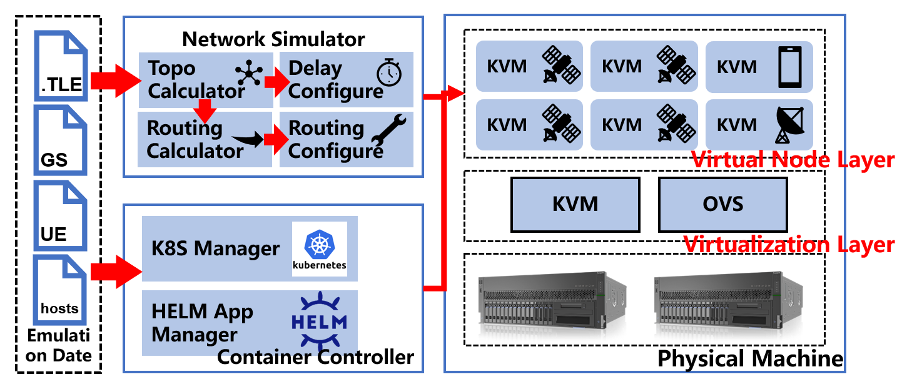
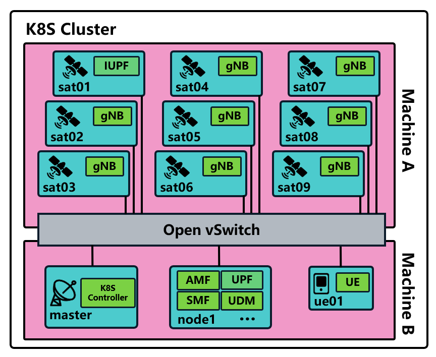
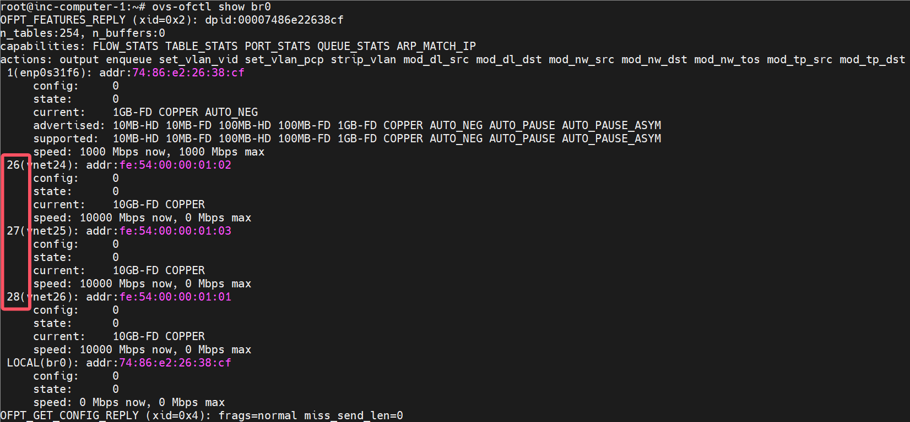
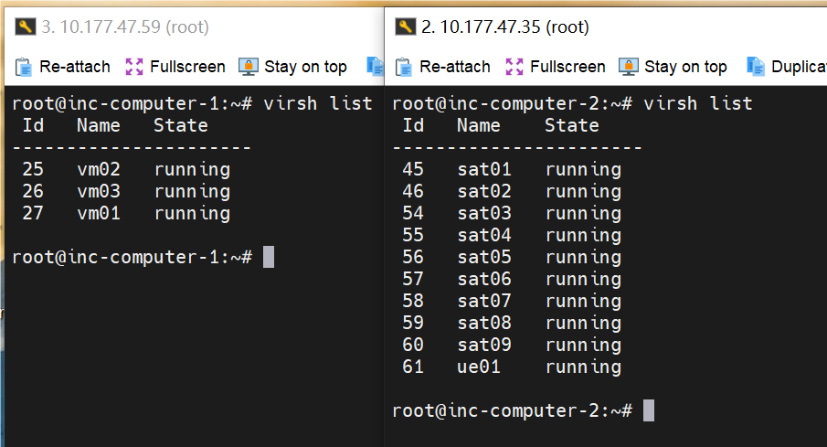
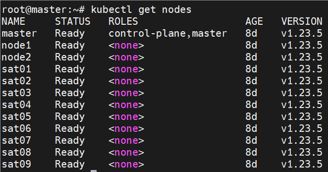
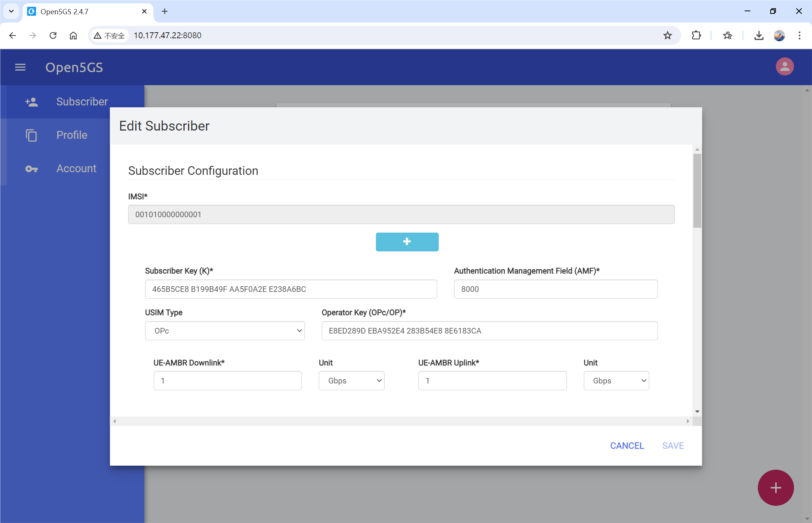
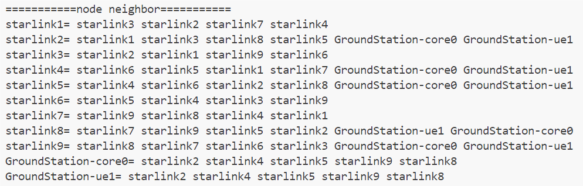
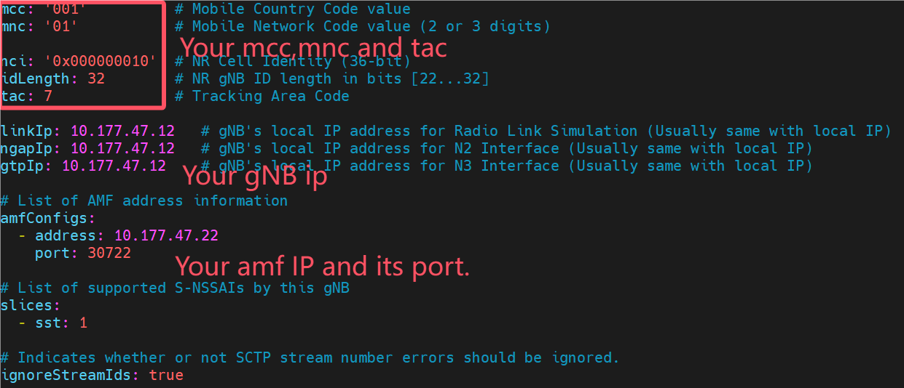
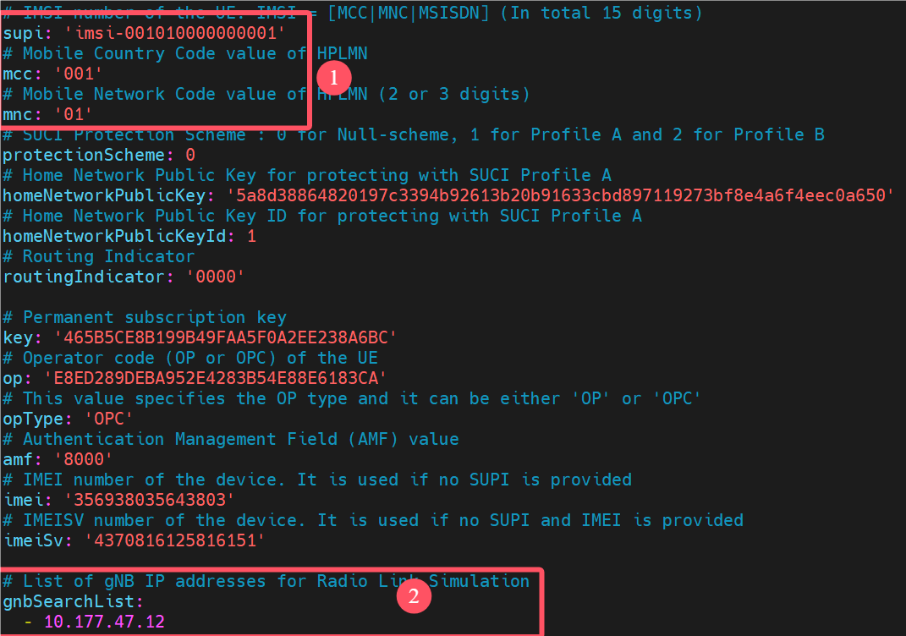
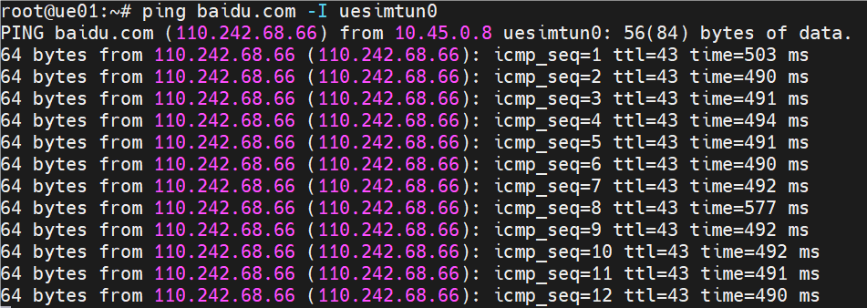

# Gemini User Guide

## Introduction

Gemini is a satellite 5G network emulation platform.

It use KVM to simulate **satellites and gound equipments**, use modified open5gs to run **5G network functions**, use K8S to **manage cluster**, use ovs and Linux tc to simulate **inter-satellite routing and propagation delay**.



You can launch **any number** of virtual machine nodes to simulate satellites or ground equipment, next we will introduce how to simulate the 5G communication process of a 3×3 constellation.



## Preparation

1. **KVM**：Prepare your physical machine to run KVM,  they should be in the same LAN so that we can use ovs to control the traffic direction. Below table list the recommended config of KVM.

   |    role    | CPU  | Memoty(G) | Disk(G) |
   | :--------: | :--: | :-------: | :-----: |
   | k8s_master |  2   |     2     |   30    |
   |    core    |  2   |     2     |   30    |
   |    sat     |  1   |     1     |   30    |
   |     ue     |  1   |     1     |   10    |

2. **OVS**：Install and start up OVS on physical machine,  and config your kvm to connect the ovs bridge.

   ```sh
   # config ovs on physical machine
   ovs-vsctl add-br br0
   ovs-vsctl add-port br0 $your_wired_network_card_name
   ifconfig $your_wired_network_card_name 0
   dhclient br0
   
   # config network of kvm
   vim /etc/libvirt/qemu/networks/br0_network.xml
   <network>
     <name>br0_network</name>
     <forward mode='bridge'/>
     <bridge name='br0'/>
     <virtualport type='openvswitch'/>
   </network>
   # apply the kvm net config
   sudo virsh net-define /etc/libvirt/qemu/networks/br0_network.xml
   sudo virsh net-start br0_network
   ```

3. Write your machine info like ip, port, in the **host.json**.

   ```python
   {
       ...
       "starlink1": {
           "role": "sat",
           "ip": "10.177.47.11", # this kvm ip
           "port": 22, # ssh port
           "username": "root",
           "password": "123",
           "host": "host2", # physical machine of kvm
           "bridge": "br0", # bridge name of ovs
           "nic_name": "enp1s0", # network card name of kvm
           "if_port": 32, # kvm port num on the ovs
           "mac": "52:54:00:00:00:01" # this kvm mac
       },
       ...
   }
   ```
   
   The if_port can be got with `ovs-ofctl show br0`, and you can get th info of kvm network card with its number.

   

Finally ,if you prepare the same 3×3 constellation, your kvm may be like this, the left is the kvm run the k8s_master and ground core network functions, vm01 and vm02(vm03 just for test), the right show the satellite and ue kvms.


## Start up Kubernetes

We need to install kubernetes to manage the whole cluster, below commands show the progress to install and start up a kubernetes cluster.
```sh
# modify network bridge config
vim /etc/sysctl.d/k8s.conf

net.bridge.bridge-nf-call-ip6tables = 1
net.bridge.bridge-nf-call-iptables = 1
net.ipv4.ip_forward = 1
vm.swappiness = 0

# apply the config
modprobe br_netfilter
sysctl -p /etc/sysctl.d/k8s.conf

# install docker
apt update
apt install apt-transport-https ca-certificates curl gnupg-agent software-properties-common
curl -fsSL https://download.docker.com/linux/ubuntu/gpg | sudo apt-key add -
sudo add-apt-repository "deb [arch=amd64] https://download.docker.com/linux/ubuntu $(lsb_release -cs) stable"
sudo apt update
sudo apt install -y docker-ce=5:20.10.7~3-0~ubuntu-focal docker-ce-cli=5:20.10.7~3-0~ubuntu-focal containerd.io
apt-mark hold docker-ce

# install kubernetes
curl https://mirrors.aliyun.com/kubernetes/apt/doc/apt-key.gpg | sudo apt-key add - 
apt-add-repository "deb https://mirrors.aliyun.com/kubernetes/apt/ kubernetes-xenial main"
## master
apt-get install -y kubeadm=1.23.5-00 kubelet=1.23.5-00 kubectl=1.23.5-00
apt-mark hold kubeadm kubelet
## node
apt-get install -y kubeadm=1.23.5-00 kubelet=1.23.5-00
apt-mark hold kubeadm kubelet kubectl

# install helm on master
curl https://baltocdn.com/helm/signing.asc | gpg --dearmor | sudo tee /usr/share/keyrings/helm.gpg > /dev/null
sudo apt-get install apt-transport-https --yes
echo "deb [arch=$(dpkg --print-architecture) signed-by=/usr/share/keyrings/helm.gpg] https://baltocdn.com/helm/stable/debian/ all main" | sudo tee /etc/apt/sources.list.d/helm-stable-debian.list
sudo apt-get update
apt-get install helm=3.9.4-1
```

Next, we can init cluster on master:

```sh
kubeadm init --kubernetes-version=v1.23.5 --pod-network-cidr=10.244.0.0/16 --image-repository registry.aliyuncs.com/google_containers --service-cidr=10.96.0.0/12 --apiserver-advertise-address=10.177.47.21
mkdir -p $HOME/.kube
sudo cp -i /etc/kubernetes/admin.conf $HOME/.kube/config
sudo chown $(id -u):$(id -g) $HOME/.kube/config
```

Then use the token get by master to join the worker nodes:

```sh
kubeadm join 10.177.47.21:6443 --token bwalgb.4v6kevyuvsj259t8 --discovery-token-ca-cert-hash sha256:757b3d6408eb113428292fcb7f18c9f4a55bd1635b547625374cc495dd0bfa8b
```

This command can get the join token if you forget the old one:

```sh
kubeadm token create --print-join-command
```

After that ,use `kubectl get node`, then you can get it, your node maybe `Not Ready`, it is normal, because will config the network plugin in the next step.

## Start up Open5GS on K8S

1. Download the k8s-open5gs.tar,gz(in this repository) and unzip it on your master machine, cd into the directory and edit the kube-flannel.yml, in line 189, set the iface to the network card name of your master kvm.

2. Downloat the flannel and put it on the /opt/cni/bin/ directory of every kvm.

   ```sh
   wget https://github.com/containernetworking/plugins/releases/download/v1.5.1/cni-plugins-linux-amd64-v1.5.1.tgz
   tar zxvf cni-plugins-linux-amd64-v1.5.1.tgz
   cp flannel /opt/cni/bin/
   ```

3. Use `kubectl apply -f kube-flannel.yml`, and now your node will be ready.



4. On master, lable the nodes and start up open5gs use helm

   ```sh
   # lable master scheduleable, set node1 to run control plane NF, set sat01 to run iupf.
   kubectl taint nodes --all node-role.kubernetes.io/master-
   kubectl label nodes node1 mobile-core=cp
   kubectl label nodes sat01 mobile-core=up2
   ```

5. Pull the images of open5gs and start up.

   We make the docker images by ourselves and upload them on the aliyun repository.

   Pull the images to the kvm which run the **5G control plane kvm**.

   ```sh
   docker pull registry.cn-hangzhou.aliyuncs.com/inclab/mongo
   docker tag registry.cn-hangzhou.aliyuncs.com/inclab/mongo:latest mongo:5.0
   docker pull registry.cn-hangzhou.aliyuncs.com/inclab/inc-core-newww
   docker tag registry.cn-hangzhou.aliyuncs.com/inclab/inc-core-newww:latest oreofroyo/inc-core-newww:latest
   docker pull registry.cn-hangzhou.aliyuncs.com/inclab/ogs-webui-2.4.8
   docker tag regregistry.cn-hangzhou.aliyuncs.com/inclab/ogs-webui-2.4.8:latest naposto/ogs-webui-2.4.8:latest
   ```

   Pull the image to the kvm which run the **IUPF**

   ```sh
   docker pull registry.cn-hangzhou.aliyuncs.com/inclab/inc-core-newww
   docker tag registry.cn-hangzhou.aliyuncs.com/inclab/inc-core-newww:latest oreofroyo/inc-core-newww:latest
   ```

   The run the helm to start up open5gs.

   ```sh
   kubectl create namespace open5gs
   helm install open5gs -n open5gs .
   ```

Now, you successfully get a 5G core network, you can register your ue on the webui.



## Start up routing simulator

Please prepare the TLE file of your constellation and make sure that your host.json, real kvm and your expected constellation(tle file) are be consistent.

Then, according to the environment.yml, you can run `conda env create -f environment.yml` to install the dependences.

Then, just run python ./system.py, and the script will connect your machine and set the ovs rule and tc filter, to simulate the inter satellite link routing and the physical propagation delay.

The log will output the current delay matrix, and the neighbor relation between satellite and ground equipments, like below.



## 5G Communications Test 

We use UERANSIM to simulate the gNB and UE.

in KVM which run gNB and UE, clone the UERANSIM repository and install it.

```sh
git clone https://github.com/OreoFroyo/UERANSIM_beforehandHO
# Install dependencies
sudo apt update
sudo apt upgrade
sudo apt install make
sudo apt install gcc
sudo apt install g++
sudo apt install libsctp-dev lksctp-tools
sudo apt install iproute2
sudo snap install cmake --classic
# Complie it
cd ~/UERANSIM_beforehandHO
make
```

Then, modify the open5gs-gnb.yaml in gNB kvm and the open5gs-ue.yaml in UE.





After that, run `build/nr-gnb -c config/open5gs-gnb.yaml` to start the gnb and run `build/nr-ue -c config/open5gs-ue.yaml` to start the UE.

Then, you can get a new network card called uesimtun0 on the ue kvm, you can use it to ping google.com, the network traffic will go to google's data center through the gNB->iupf->upf. And because of our routing simulator is running, you can watch that the ping delay is longer than befor and it will change with the move of constellation.



## Appendix A: FAQ

1. K8S Master node init wrong.

   ```sh
   The HTTP call equal to 'curl -sSL http://localhost:10248/healthz' failed with error: Get "http://localhost:10248/healthz": dial tcp 127.0.0.1:10248: connect: connection refused.
   ```

   Run the below command on all nodes.

   ```sh
   echo '{"exec-opts": ["native.cgroupdriver=systemd"]}' | sudo tee /etc/docker/daemon.json
   systemctl daemon-reload
   systemctl restart docker
   systemctl restart kubelet
   ```

2. If you want to go into a container, you can run this command: `kubectl exec -it $pod_name -n $namespace_name bash`.